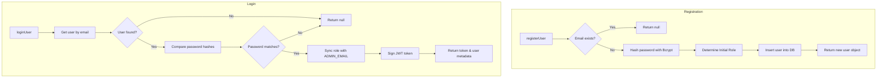
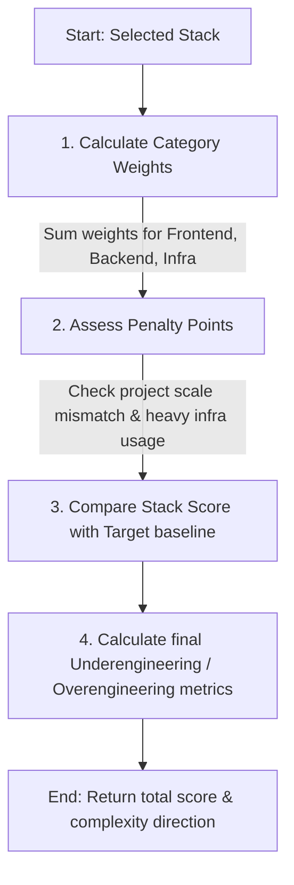

# OverEngineeringDetector Codebase Explanation

This file contains explanations of the code structure, logic, and patterns used in the OverEngineeringDetector project.

---

## 1. Project Structure & Code Reading Order

For a developer learning the project for the first time, here is the recommended sequence to explore the codebase:

### Phase 1: Database & Data Model (The Foundation)
Start here to understand what resources exist in the application (Users, Projects, Technologies, and Analysis Results) and how they relate to each other.
* **[sql_scripts/tables.sql](file:///c:/Users/pelin/Downloads/OverEngineeringDetector_swagger_fixed_port3001/OverEngineeringDetector/sql_scripts/tables.sql)**: Defines the PostgreSQL schema. Pay attention to how `projects` tie to `users`, how `project_technologies` links projects to technologies, and how `analysis_results` maps back to projects.
* **[sql_scripts/populate_data.sql](file:///c:/Users/pelin/Downloads/OverEngineeringDetector_swagger_fixed_port3001/OverEngineeringDetector/sql_scripts/populate_data.sql)**: Shows some seed data for technologies to understand how weight and attributes are structured.

### Phase 2: Backend Core (Architecture & Flow)
Next, follow how the Express web server bootstraps, defines its routes, uses middlewares, and delegates request handling to controllers.
* **[backend/src/config/](file:///c:/Users/pelin/Downloads/OverEngineeringDetector_swagger_fixed_port3001/OverEngineeringDetector/backend/src/config/)**: `env.js` and `db.js` configure environment variables and initialize the PostgreSQL client pool.
* **[backend/src/server.js](file:///c:/Users/pelin/Downloads/OverEngineeringDetector_swagger_fixed_port3001/OverEngineeringDetector/backend/src/server.js)**: The entry point of the backend app. It mounts static files, configures Swagger UI, and registers routes.
* **[backend/src/middleware/authMiddleware.js](file:///c:/Users/pelin/Downloads/OverEngineeringDetector_swagger_fixed_port3001/OverEngineeringDetector/backend/src/middleware/authMiddleware.js)**: Implements JWT verification to protect project and analysis API endpoints.
* **[backend/src/routes/](file:///c:/Users/pelin/Downloads/OverEngineeringDetector_swagger_fixed_port3001/OverEngineeringDetector/backend/src/routes/)**: Houses routes (`authRoutes.js`, `projectRoutes.js`, `technologyRoutes.js`, and `analysisRoutes.js`) linking endpoints to specific controllers.
* **[backend/src/controllers/](file:///c:/Users/pelin/Downloads/OverEngineeringDetector_swagger_fixed_port3001/OverEngineeringDetector/backend/src/controllers/)**: Handlers for parsing payloads, request validation, and calling service layer functions (e.g., `projectController.js` and `analysisController.js`).

### Phase 3: The Brain (Scoring & Analysis Services)
This is where the actual business logic lives. This layer performs database queries, evaluates project scale/complexity, calculates overengineering metrics, and generates reports.
* **[backend/src/services/authService.js](file:///c:/Users/pelin/Downloads/OverEngineeringDetector_swagger_fixed_port3001/OverEngineeringDetector/backend/src/services/authService.js)** & **[projectService.js](file:///c:/Users/pelin/Downloads/OverEngineeringDetector_swagger_fixed_port3001/OverEngineeringDetector/backend/src/services/projectService.js)**: Handles registration/login (using bcrypt) and CRUD operations for projects.
* **[backend/src/services/scoringService.js](file:///c:/Users/pelin/Downloads/OverEngineeringDetector_swagger_fixed_port3001/OverEngineeringDetector/backend/src/services/scoringService.js)**: Maps daily users and project scale to a target complexity value and calculates if selected technologies exceed it.
* **[backend/src/services/analysisService.js](file:///c:/Users/pelin/Downloads/OverEngineeringDetector_swagger_fixed_port3001/OverEngineeringDetector/backend/src/services/analysisService.js)**: Orchestrates the entire analysis process: runs the scoring algorithm, flags specific issues, and saves the final result (along with suggestions) to the database.

### Phase 4: Frontend (User Interface & Interaction)
Finally, look at how the user interacts with the API through the client web application.
* **[frontend/index.html](file:///c:/Users/pelin/Downloads/OverEngineeringDetector_swagger_fixed_port3001/OverEngineeringDetector/frontend/index.html)**: Contains the single-page application structure.
* **[frontend/app.js](file:///c:/Users/pelin/Downloads/OverEngineeringDetector_swagger_fixed_port3001/OverEngineeringDetector/frontend/app.js)**: Manages state, handles DOM updates, logs in/out users, and triggers analyses or what-if simulations against the backend.

---

## 2. Server Configuration Explained (`backend/src/server.js`)

### Middleware Configuration

```javascript
app.use(express.json());
app.use(express.static(frontendPath));
app.use("/api-docs/assets", express.static(swaggerUiPath));
```

1. **`app.use(express.json())`**: Built-in Express middleware that parses incoming requests with JSON payloads (i.e. `Content-Type: application/json`). It populates the `req.body` object. Without this, your controllers wouldn't be able to access the data sent in HTTP `POST` or `PUT` request bodies.
2. **`app.use(express.static(frontendPath))`**: Serves static files from the `frontend` folder. This allows the backend server to serve the frontend web application directly to the browser (e.g., loading `index.html` at `http://localhost:3001/`).
3. **`app.use("/api-docs/assets", express.static(swaggerUiPath))`**: Serves the static assets (CSS, JS, presets) needed by Swagger UI from the `swagger-ui-dist` package.

---

### Swagger UI API Documentation Route (`/api-docs`)

```javascript
app.get("/api-docs", (req, res) => {
    res.send(`<!doctype html>
<html lang="en">
...
        window.onload = () => {
            window.ui = SwaggerUIBundle({
                url: "/openapi.json",
                dom_id: "#swagger-ui",
                presets: [
                    SwaggerUIBundle.presets.apis,
                    SwaggerUIStandalonePreset
                ],
                layout: "StandaloneLayout",
                persistAuthorization: true
            });
        };
...
</html>`);
});
```

* **What it is**: Serves an HTML page representing Swagger UI. This is an interactive, browser-based documentation dashboard showing all backend endpoints.
* **How it works**:
  1. Renders a container `<div id="swagger-ui"></div>`.
  2. Loads Swagger UI CSS and JavaScript assets (served from the static middleware configuration).
  3. Executes `SwaggerUIBundle({...})`, pointing it to `/openapi.json` to load the API definition object.
  4. Swagger UI then dynamically constructs the developer documentation page, letting developers view endpoints and run test requests directly in the browser.

---

### Route Mounting & Health Check Endpoint

```javascript
app.use("/", authRoutes);
app.use("/", projectRoutes);
app.use("/", analysisRoutes);
app.use("/", technologyRoutes);

app.get("/health", (req, res) => {
    res.json({
        status: "ok",
        message: "Server is running"
    });
});
```

#### 1. Router Mounting (`app.use("/", ...Routes)`)
* **What it is**: Express Router allows you to organize your route paths and logic into separate files instead of putting hundreds of lines in `server.js`.
* **How the syntax works**:
  * `app.use(path, router)` mounts the specified router middleware at the specified path prefix. 
  * Here, `"/"` means the base URL. For example, if `authRoutes` defines a route for `POST /login`, mounting it at `"/"` makes it accessible at `http://localhost:3001/login`. If it was mounted at `/auth` (e.g., `app.use("/auth", authRoutes)`), it would become `http://localhost:3001/auth/login`.
* **Why it's structured this way**: Splitting the endpoints into components (`auth`, `project`, `analysis`, `technology`) keeps the codebase modular, clean, and easier to scale.

#### 2. Health Check Endpoint (`app.get("/health", ...)`)
* **What it is**: A standard lightweight GET endpoint that returns `{"status":"ok","message":"Server is running"}` in JSON format.
* **Why we do it**: It provides a simple way for monitoring systems, load balancers, cloud platforms (e.g., AWS, GCP, Render), or external status pages to ping the server and confirm the application is successfully booted up and accepting requests.

---

### OpenAPI / Swagger Specification (`openApiSpec`)

```javascript
import { openApiSpec } from "./docs/openapiSpec.js";

app.get("/openapi.json", (req, res) => {
    res.json(openApiSpec);
});
```

#### 1. What is `openApiSpec`?
`openApiSpec` is a large, static JavaScript object that follows the **OpenAPI 3.0.3 specification** format. It fully describes the structure of your backend API.

#### 2. Where is it imported from?
It is defined in and exported from **[backend/src/docs/openapiSpec.js](file:///c:/Users/pelin/Downloads/OverEngineeringDetector_swagger_fixed_port3001/OverEngineeringDetector/backend/src/docs/openapiSpec.js)**.

#### 3. What does it contain?
* **Info & Metadata**: The title of the API, descriptions, contact specs, and target server URLs (`http://localhost:3000`, `http://localhost:3001`).
* **Security Definitions**: Specifically, configuring JWT Bearer authorization (`bearerAuth`) so clients can authorize their requests using tokens.
* **Component Schemas**: Reusable JSON structures for validation and response typing:
  * `User`, `Project`, `Technology`, `Scores`, `Analysis`, `WhatIfPayload`, and `Error`.
* **API Paths**: Detailed documentation for every single HTTP route (`/auth/register`, `/projects`, `/analysis/{projectId}`, etc.), including:
  * Which HTTP method is used.
  * Which input parameters (path params or query params) are required.
  * The exact request body format.
  * The possible response statuses (e.g., `200 OK`, `400 Bad Request`, `401 Unauthorized`, `404 Not Found`) and what their JSON schemas look like.

---

### Port Binding & Process Event Handlers

```javascript
const PORT = Number(process.env.PORT || 3001);

const server = app.listen(PORT, () => {
    console.log(`Server is running on port ${PORT}`);
});

server.on("error", (error) => {
    console.error("SERVER ERROR:", error);
});

process.on("exit", (code) => {
    console.log("Process is exiting with code:", code);
});

process.on("uncaughtException", (err) => {
    console.error("UNCAUGHT EXCEPTION:", err);
});

export default server;
```

#### 1. Port Configuration (`PORT`)
* Reads `process.env.PORT` from the environment. If it is not configured, it defaults to port `3001`. It casts the value to a number.

#### 2. Starting the Server (`app.listen`)
* Starts the Express application as an HTTP server, binding it to the defined `PORT`. It outputs a console message when the server successfully starts listening for requests.

#### 3. Server Error Handling (`server.on("error")`)
* Listens for issues on the server socket. A common server error is `EADDRINUSE` (when the chosen port is already in use by another application). This prevents the application from failing silently.

#### 4. Node.js Process Events
* **`process.on("exit")`**: Listens for when the Node process is shutting down. It logs the exit code (e.g., `0` for successful termination, or non-zero if terminated due to an error).
* **`process.on("uncaughtException")`**: Listens for any runtime errors that occurred outside of a standard `try-catch` block. It prints the stack trace, which is crucial for debugging production bugs that would otherwise crash the application silently.

#### 5. Exporting Server (`export default server`)
* Exports the server instance. This allows automated test files (such as integration tests in the `test/` directory) to import the server, start it up, query its routes, and close it when done.

---

## 3. Authentication & Authorization Middleware (backend/src/middleware/authMiddleware.js)

This module handles authentication (determining *who* a user is via JWTs) and authorization (determining *what* permissions a user has).

### JWT Secret Key Retrieval (`getJwtSecret`)

```javascript
const getJwtSecret = () => process.env.JWT_SECRET;
```

#### 1. What is this function?
It is a utility helper that returns the secret cryptographic key used to **sign** (when generating) and **verify** (when validating) JSON Web Tokens (JWT).

#### 2. How does the logic work?
* **`process.env.JWT_SECRET`**: It reads the `JWT_SECRET` variable from your environment variables (populated from the `.env` file).
* **Guaranteed Configuration**: Because the application automatically generates a secure random secret key if it is missing or set to a placeholder, and because the Zod environment schema validates and ensures it is defined, there is no need for insecure hardcoded fallback strings. If the key is not configured, the validation will fail early at server startup.

---

### JWT Authentication Middleware (`authenticateToken`)

```javascript
export const authenticateToken = (req, res, next) => {
    const token = extractToken(req);

    if (!token) {
        return res.status(401).json({ error: "Authorization token is required." });
    }

    try {
        const decoded = jwt.verify(token, getJwtSecret());
        req.user = decoded;
        next();
    } catch (error) {
        return res.status(403).json({ error: "Invalid or expired token." });
    }
};
```

#### 1. What is this function?
It is an Express **middleware** function. In Express, middleware functions execute during the lifecycle of a request to the server, having access to the request object (`req`), the response object (`res`), and the `next` function to proceed.

#### 2. How the logic works:
1. **Extracts the Token**: Calls `extractToken(req)` to search for the JWT in either cookies or the `Authorization: Bearer` header.
2. **Aborts if Missing**: If no token is found (`!token`), it intercepts the request and returns a `401 Unauthorized` response. The request is stopped immediately and never reaches your route controllers.
3. **Verifies the Token**: Inside a `try/catch` block, it validates the token using `jwt.verify(token, getJwtSecret())`.
4. **Attaches User Data**: If verification is successful, it attaches the decoded token payload (which contains `id`, `email`, and `role`) directly onto the request object as `req.user`. This makes the logged-in user's details available to all subsequent middleware and controllers.
5. **Calls `next()`**: Invokes `next()` to hand off control to the next handler in the route definition.
6. **Handles Invalid/Expired Tokens**: If `jwt.verify` throws an error (e.g. if the token expired or was modified/tampered with), the `catch` block intercepts the error and returns a `403 Forbidden` response.

---

### Admin Authorization Middleware (`authorizeAdmin`)

```javascript
export const authorizeAdmin = (req, res, next) => {
    if (req.user?.role !== "admin") {
        return res.status(403).json({ error: "Admin access is required." });
    }
    next();
};
```

#### 1. What is this function?
This is a **Role-Based Access Control (RBAC) middleware**. While `authenticateToken` verifies *who* the user is, `authorizeAdmin` verifies if they have the *correct role/permissions* to access sensitive, administrative-level endpoints (such as managing technologies).

#### 2. How the logic works step-by-step:
1. **Pre-requisite (Execution Order)**: This middleware is designed to run **after** `authenticateToken`. Since `authenticateToken` successfully verified the token and attached the decoded payload to `req.user`, `authorizeAdmin` can safely inspect `req.user`'s properties.
2. **Check the user's role**:
   * It uses optional chaining (`req.user?.role`) to safely check the user's role. If the user object is missing, or if the role is not exactly `"admin"` (e.g., `"user"`), the request is blocked.
   * The server immediately returns an HTTP `403 Forbidden` status code with a JSON payload: `{ error: "Admin access is required." }`.
3. **Allow access**:
   * If the user's role is `"admin"`, the middleware calls `next()`. This passes control to the next handler/controller in the route queue, allowing the request to proceed.

---

## 4. Security Hardening & Crash Prevention Updates

We implemented security updates and crash-prevention safeguards in both the backend and frontend:

### 1. Environment Configurations & JWT Secret Setup
* **Action**: Created **[backend/.env](file:///c:/Users/pelin/Downloads/OverEngineeringDetector_swagger_fixed_port3001/OverEngineeringDetector/backend/.env)** by copying `.env.example` and populating it with a cryptographically strong, random, and secret 256-bit string for `JWT_SECRET`.
* **Benefit**: Ensures that JSON Web Tokens generated by the app cannot be forged or guessed by attackers in any deployed environment.

### 2. Safe Token Extraction (`backend/src/middleware/authMiddleware.js`)
* **Action**: Updated `extractToken` to run inside a `try/catch` block and implemented **optional chaining** (`req?.headers?.cookie` and `req?.headers?.authorization`).
* **Benefit**: Prevents the backend server from crashing if a request is made with completely missing headers, a missing request object, or if custom clients send malformed data.

#### How `extractToken` Works Step-by-Step:
1. **Try-Catch Wrapper**:
   * The whole function runs inside a `try/catch` block. If any unexpected error occurs (e.g., if the request structure is corrupt), the error is logged and `null` is returned instead of crashing the Node process.
2. **Safe Cookie Header Retrieval**:
   * `req?.headers?.cookie || ""` reads the `Cookie` request header. By using optional chaining (`?.`), it guarantees the server won't throw a `TypeError` if `req` or `req.headers` is undefined. It defaults to `""` if the header doesn't exist.
3. **Cookie Parsing**:
   * `cookieHeader.split(";")` splits the cookies string (e.g., `"token=abc; theme=dark"`) into individual cookies (`["token=abc", " theme=dark"]`).
   * `.map(c => c.trim())` removes leading/trailing whitespaces (converting `" theme=dark"` to `"theme=dark"`).
   * `.find(c => c.startsWith("token="))` searches for the key-value pair starting with `"token="`.
   * `?.slice("token=".length)` safely slices off `"token="` (leaving `"abc"`), using optional chaining in case no token cookie was found. If a token is successfully found, it is immediately returned.
4. **Fallback to Bearer Token (Authorization Header)**:
   * If there is no token cookie, it reads `req?.headers?.authorization || ""`.
   * `.trim().split(/\s+/)` trims the header string and splits it by one or more spaces (e.g., `"Bearer  my_token"` becomes `["Bearer", "my_token"]`).
   * It validates that the array has exactly two elements and the first element is `"Bearer"`. If valid, it returns the second element (`parts[1]`).
5. **Default Fallback**:
   * If both extraction methods fail, it falls back to returning `null`.

### 3. Safe Session State Parsing (`frontend/app.js`)
* **Action**: Wrapped the initial load parsing of the user state (`JSON.parse(localStorage.getItem("user") || "null")`) inside a `try/catch` block.
* **Benefit**: Prevents the frontend web app from crashing on start if the browser's `localStorage` gets corrupted or holds invalid/malformed JSON strings. If parsing fails, it safely cleans up `localStorage` and falls back to a signed-out state.

### 4. Automatic JWT Secret Key Generation (`backend/src/config/env.js`)
* **Action**: Added an `ensureJwtSecret` check prior to running `dotenv.config()`. It checks if `JWT_SECRET` is missing in the environment, empty, or set to the default placeholder (`your_jwt_secret_here`). If so, a cryptographically secure 256-bit key (`crypto.randomBytes(32).toString('hex')`) is automatically generated and updated in the `.env` file. We also updated the Zod schema to enforce that `JWT_SECRET` is a non-empty string.
* **Benefit**: Guarantees that the backend server is always started with a secure, unique `JWT_SECRET` key, preventing insecure fallbacks or deployment failures when the environment variables are not manually configured by the developer.

---

## 5. How Projects are Associated with a User

The application connects the projects page to a specific user through a secure, end-to-end flow from the browser to the PostgreSQL database. Here is exactly how that process works step-by-step:

### Step 1: User Login & Session Persistence
1. The user logs in via the login form in [app.js](file:///c:/Users/pelin/Downloads/OverEngineeringDetector_swagger_fixed_port3001/OverEngineeringDetector/frontend/app.js) by sending a request to `POST /auth/login`.
2. On success, the backend generates a JWT containing the user's `id`, `email`, and `role`, and sends it back to the browser inside an **HTTP-only cookie** named `token`.
3. The frontend stores basic non-sensitive user info (such as email and role) in `localStorage` to reflect the logged-in UI state.

### Step 2: Browser Sends the Request
1. When fetching the projects list or loading the projects page, the frontend calls `api("/projects")` using `fetch`.
2. Because the API request is configured with `credentials: "same-origin"`, the browser automatically includes the HTTP-only `token` cookie in the request headers.

### Step 3: Middleware Authentication (`authenticateToken`)
1. The routes in [projectRoutes.js](file:///c:/Users/pelin/Downloads/OverEngineeringDetector_swagger_fixed_port3001/OverEngineeringDetector/backend/src/routes/projectRoutes.js#L17-L28) are protected using the `authenticateToken` middleware:
   ```javascript
   router.get("/projects", authenticateToken, getAllProjectsController);
   ```
2. The request first passes through [authenticateToken](file:///c:/Users/pelin/Downloads/OverEngineeringDetector_swagger_fixed_port3001/OverEngineeringDetector/backend/src/middleware/authMiddleware.js#L32-L46):
   * It extracts the token using `extractToken(req)`.
   * It verifies the token using `jwt.verify(token, getJwtSecret())`.
   * Upon successful verification, it extracts the user's payload (including the user's database `id`) and attaches it to the request object as `req.user` (i.e., `req.user = decoded;`).
   * It calls `next()` to proceed.

### Step 4: Controller Extracts User ID
1. Control reaches [getAllProjectsController](file:///c:/Users/pelin/Downloads/OverEngineeringDetector_swagger_fixed_port3001/OverEngineeringDetector/backend/src/controllers/projectController.js#L33-L41) in [projectController.js](file:///c:/Users/pelin/Downloads/OverEngineeringDetector_swagger_fixed_port3001/OverEngineeringDetector/backend/src/controllers/projectController.js):
   ```javascript
   export const getAllProjectsController = async (req, res) => {
       try {
           const projects = await getAllProjects(req.user.id);
           res.json(projects);
       } catch (error) { ... }
   };
   ```
2. The controller extracts the user's unique database ID from `req.user.id` and passes it to the service layer.

### Step 5: Database Filtering (Service Layer)
1. The service function [getAllProjects](file:///c:/Users/pelin/Downloads/OverEngineeringDetector_swagger_fixed_port3001/OverEngineeringDetector/backend/src/services/projectService.js#L17-L42) in [projectService.js](file:///c:/Users/pelin/Downloads/OverEngineeringDetector_swagger_fixed_port3001/OverEngineeringDetector/backend/src/services/projectService.js) issues a SQL query to the database:
   ```sql
   SELECT p.*, ...
   FROM projects p
   ...
   WHERE p.user_id = $1
   ...
   ```
2. By adding `WHERE p.user_id = $1` (parameterized to `userId`), the database ensures that **only** the projects created by and associated with this specific user are retrieved.
3. For write operations (updates, deletion, adding technologies), the service functions similarly enforce ownership by matching the project ID *and* the user ID:
   ```sql
   UPDATE projects SET ... WHERE id = $5 AND user_id = $6
   ```
   This prevents any authenticated user from editing or deleting projects belonging to a different user.

---

## 6. PostgreSQL JSON Aggregation & `COALESCE` Explained

In [projectService.js](file:///c:/Users/pelin/Downloads/OverEngineeringDetector_swagger_fixed_port3001/OverEngineeringDetector/backend/src/services/projectService.js#L17-L42), the SQL query for `getAllProjects` uses complex aggregation functions to bundle a project's selected technologies into a single database response row.

### What does `COALESCE` do?
`COALESCE` is a built-in SQL function that evaluates a list of arguments in order and returns the **first non-null value** it encounters. 

```sql
COALESCE(expression_1, expression_2, ..., expression_n)
```

### Why is it used here?
In the query, we aggregate the joined technologies using `JSON_AGG` and `JSONB_BUILD_OBJECT`:

```sql
COALESCE(
    JSON_AGG(
        JSONB_BUILD_OBJECT(
            'id', t.id,
            'name', t.name,
            'category', t.category,
            'complexity_weight', t.complexity_weight
        )
        ORDER BY t.category ASC, t.name ASC
    ) FILTER (WHERE t.id IS NOT NULL),
    '[]'
) AS technologies
```

---

### 1. `JSONB_BUILD_OBJECT`
This function builds a JSON object (specifically in the binary-optimized `JSONB` format) from a list of alternating keys and values.
* **Syntax**: `JSONB_BUILD_OBJECT('key1', value1, 'key2', value2, ...)`
* **In this query**:
  ```sql
  JSONB_BUILD_OBJECT(
      'id', t.id,
      'name', t.name,
      'category', t.category,
      'complexity_weight', t.complexity_weight
  )
  ```
  For every technology row returned by the SQL join, this converts the database columns into a single JSON object. For example:
  ```json
  {
      "id": 1,
      "name": "React",
      "category": "Frontend",
      "complexity_weight": 2
  }
  ```

---

### 2. `JSON_AGG`
This is an **aggregate function** (similar to `SUM()` or `COUNT()`). Instead of summing numbers, it collects values (in this case, the JSON objects generated by `JSONB_BUILD_OBJECT`) from multiple rows and aggregates them into a **single JSON array**.
* **Syntax**: `JSON_AGG(expression [ORDER BY ...])`
* **In this query**: It takes the JSON objects representing each technology, sorts them, and aggregates them into a single array:
  ```json
  [
      { "id": 1, "name": "React", "category": "Frontend", "complexity_weight": 2 },
      { "id": 5, "name": "Docker", "category": "Infrastructure", "complexity_weight": 3 }
  ]
  ```

---

5. **Benefit**: This guarantees that the server always sends a valid, consistent datatype (an array) to the client, even when the project has zero technologies.

---

### 4. Step-by-Step Query Execution (The Pipeline)

To visualize how this complex query works, let's trace a sample database state through all 7 logical execution steps.

#### Sample Data State:
**`projects` table:**
| id | user_id | name |
|----|---------|------|
| 1  | 99      | "Project A" (User 99's project) |
| 2  | 99      | "Project B" (User 99's empty project) |
| 3  | 100     | "Project C" (Someone else's project) |

**`project_technologies` table:**
| project_id | technology_id |
|------------|---------------|
| 1          | 101           |
| 1          | 102           |

**`technologies` table:**
| id  | name   | category | complexity_weight |
|-----|--------|----------|-------------------|
| 101 | React  | Frontend | 6                 |
| 102 | Docker | DevOps   | 6                 |

---

### The 7 Execution Steps:

#### Step 1: Joins the Tables (`LEFT JOIN`)
We perform left joins between `projects`, `project_technologies`, and `technologies`. If a project has multiple technologies, it temporarily generates one row per technology.
*Intermediate Result:*
| p.id | p.user_id | p.name | t.id | t.name | t.category | t.complexity_weight |
|------|-----------|--------|------|--------|------------|---------------------|
| 1    | 99        | Project A | 101  | React  | Frontend   | 6                   |
| 1    | 99        | Project A | 102  | Docker | DevOps     | 6                   |
| 2    | 99        | Project B | NULL | NULL   | NULL       | NULL                |
| 3    | 100       | Project C | NULL | NULL   | NULL       | NULL                |

#### Step 2: Filters by User (`WHERE p.user_id = $1`)
We filter the intermediate table by the user ID (e.g. `99`). The database discards any rows that do not belong to the user making the request (discarding Project C).
*Intermediate Result:*
| p.id | p.user_id | p.name | t.id | t.name | t.category | t.complexity_weight |
|------|-----------|--------|------|--------|------------|---------------------|
| 1    | 99        | Project A | 101  | React  | Frontend   | 6                   |
| 1    | 99        | Project A | 102  | Docker | DevOps     | 6                   |
| 2    | 99        | Project B | NULL | NULL   | NULL       | NULL                |

#### Step 3: Groups by Project (`GROUP BY p.id`)
We instruct the database to collapse all rows sharing the same project ID (`p.id`) into a **single distinct row**. Without grouping, we would get duplicate project rows for Project A.
*Intermediate Groups:*
* **Group 1 (Project A):** Contains 2 technology rows (`React` and `Docker`).
* **Group 2 (Project B):** Contains 1 technology row (`NULL`).

#### Step 4: Constructs the JSON Objects (`JSONB_BUILD_OBJECT`)
For each technology record in a group, the database converts the columns into a formatted JSON object.
*Intermediate Result:*
* **Group 1 (Project A):**
  * Row 1 $\rightarrow$ `{"id": 101, "name": "React", "category": "Frontend", "complexity_weight": 6}`
  * Row 2 $\rightarrow$ `{"id": 102, "name": "Docker", "category": "DevOps", "complexity_weight": 6}`
* **Group 2 (Project B):**
  * Row 1 $\rightarrow$ `{"id": null, "name": null, "category": null, "complexity_weight": null}`

#### Step 5: Ignores Nulls (`FILTER (WHERE t.id IS NOT NULL)`)
This filter prevents PostgreSQL from putting empty `null` objects inside the final aggregated list for projects that have no technologies.
*Intermediate Result:*
* **Group 1 (Project A):** Both rows have valid IDs $\rightarrow$ Keep both JSON objects.
* **Group 2 (Project B):** The technology ID is `NULL` $\rightarrow$ Discards the empty JSON object, leaving zero items.

#### Step 6: Aggregates into an Array (`JSON_AGG`)
The database collects all remaining JSON objects from the group and aggregates them into a single JSON array.
*Intermediate Result:*
* **Group 1 (Project A) Aggregation:** `[{"id": 101, "name": "React", ...}, {"id": 102, "name": "Docker", ...}]`
* **Group 2 (Project B) Aggregation:** `NULL` (since all elements in the group were filtered out in Step 5).

#### Step 7: Handles Empty States (`COALESCE(..., '[]')`)
If the aggregation result is `NULL` (such as for Project B), `COALESCE` replaces that `NULL` with a clean empty JSON array `'[]'` to prevent frontend application crashes.
*Final Output:*
* **Project 1 (Project A):** `[{"id": 101, "name": "React", ...}, {"id": 102, "name": "Docker", ...}]`
* **Project 2 (Project B):** `[]`

---


## 7. Dynamic Role Assignment & Admin Promotion (backend/src/services/authService.js)

The application handles user roles (e.g. `"user"`, `"admin"`) dynamically during registration and login using [getRoleForEmail](file:///c:/Users/pelin/Downloads/OverEngineeringDetector_swagger_fixed_port3001/OverEngineeringDetector/backend/src/services/authService.js#L7-L10).

### What does `getRoleForEmail` do?
It compares a user's email address with the `ADMIN_EMAIL` configured in the system environment variable (`.env`). If they match, the function assigns the user the `"admin"` role; otherwise, it assigns them the `"user"` role (or their existing role).

```javascript
const getRoleForEmail = (email, existingRole = "user") => {
    const adminEmail = process.env.ADMIN_EMAIL?.trim().toLowerCase();
    return adminEmail && email.toLowerCase() === adminEmail ? "admin" : existingRole;
};
```

### How the logic works step-by-step:
1. **Reads Environment Variable**:
   * Reads `process.env.ADMIN_EMAIL` and uses optional chaining (`?.`) to avoid crashing if it's undefined.
   * Cleans it up using `.trim()` and `.toLowerCase()` so casing or accidental whitespace won't cause matching mismatches.
2. **Case-Insensitive Match**:
   * Compares the input `email.toLowerCase()` against the configured `adminEmail`.
3. **Determines the Role**:
   * If they match, returns `"admin"`.
   * If they do not match, returns the `existingRole` parameter (which defaults to `"user"`).

### How this enables Dynamic Promotions/Demotions:
* **Registration (`registerUser`)**:
  * Calls `getRoleForEmail(email)`. The user is immediately saved in the database as `"admin"` if their email matches `ADMIN_EMAIL`.
* **Login (`loginUser`)**:
  * Every time a user logs in, the backend calls `getRoleForEmail(user.email, user.role || "user")`.
  * If the owner changes the `ADMIN_EMAIL` in the `.env` file, the user's role is automatically recalculated.
  * If a role change is detected, the database is updated dynamically:
    ```javascript
    if (role !== user.role) {
        await pool.query(`UPDATE users SET role = $1 WHERE id = $2`, [role, user.id]);
    }
    ```
  * The newly issued JWT token immediately reflects this change. This allows promoting or demoting admins simply by editing the `.env` file, without needing manual database edits or a complex admin panel.

### Critique: Is this a good practice?

In short: **Generally no for production/large-scale environments (it is an anti-pattern), but highly convenient for development, MVP, or single-developer environments.**

Here is a detailed breakdown of the pros, cons, and alternatives:

#### Pros (Why it is used here)
1. **Bootstrap Convenience**: Enables a newly registered developer account to instantly gain administrative privileges to test admin-only routes/pages without needing a database seeder script or running manual SQL commands.
2. **Zero Admin UI Required**: Removes the immediate need for a dedicated user-management dashboard or a role-management interface.

#### Cons (Why it is an anti-pattern in production)
1. **Config-to-Database Coupling**: The configuration layer (`.env`) directly drives state changes in the database. A database should ideally be the single source of truth for roles/data.
2. **Unnecessary Write Operations**: Every login checks and potentially writes to the database if roles diverge.
3. **Limited Scale**: Supports only a single hardcoded admin email. If you need multiple administrators, this approach fails or requires parsing lists of emails (e.g. comma-separated), which quickly becomes fragile.
   * If the administrator changes `ADMIN_EMAIL` in the environment to promote a *new* email, the *old* admin email still remains an admin in the database when they log in! This is because `getRoleForEmail` falls back to `existingRole` (which is `"admin"` in the database) when the email doesn't match the new env variable.
   * Conversely, it leaves orphaned database records with elevated roles that are no longer tracked in the configuration.
5. **Security Risks**: Privileged roles should be carefully audited. Having roles driven by environment variables makes it easier to accidentally escalate privileges or lose track of who has admin rights.

#### Best Practice Alternatives
* **Database Seeders**: Assign the admin role via a database migrations/seed script during deployment.
* **Database-Driven Roles**: Manage roles strictly inside the database. Build a simple UI where existing admins can search for users and toggle their role.
* **Identity Provider Integration**: Integrate with a dedicated authentication service (like Firebase, Auth0, Keycloak) where roles are managed inside the directory metadata.

#### Blueprint for Future Refactoring
To transition this app to standard practices in the future, follow these steps:
1. **Remove dynamic environment checks** from [authService.js](file:///c:/Users/pelin/Downloads/OverEngineeringDetector_swagger_fixed_port3001/OverEngineeringDetector/backend/src/services/authService.js):
   * Remove the `getRoleForEmail` function entirely.
   * In `registerUser`, set the default insert role parameter to a static `'user'`.
   * In `loginUser`, read `user.role` straight from the database row and sign it into the JWT token without executing any `UPDATE` statements.
2. **Create a Seeder script** `backend/src/scripts/seedAdmin.js` to create the initial admin user using `bcrypt.hash(password)` and inserting the user directly with the `'admin'` role:
   ```javascript
   // Run once on setup
   const result = await pool.query(
       "INSERT INTO users (email, password_hash, role) VALUES ($1, $2, 'admin') ON CONFLICT DO NOTHING",
       [email, hash]
   );
   ```
3. **Build an Admin route** `PUT /api/admin/users/:id/role` protected by `authenticateToken` and `authorizeAdmin` so existing admins can promote or demote other users securely.

---

## 8. User Registration & Parameter Syntaxes (backend/src/services/authService.js)

The [registerUser](file:///c:/Users/pelin/Downloads/OverEngineeringDetector_swagger_fixed_port3001/OverEngineeringDetector/backend/src/services/authService.js#L12-L32) function manages user registration. It utilizes two key patterns: JavaScript parameter destructuring and parameterized SQL queries.

### 1. Object Destructuring Syntax `{ email, password }`
Instead of taking individual positional arguments (like `registerUser(email, password)`), the function takes a single object and destructures it in the parameter list:
```javascript
export const registerUser = async ({ email, password }) => { ... }
```
#### Why it is used:
* **Caller Flexibility**: The caller passes a single object: `registerUser({ email: "user@example.com", password: "secure_password" })`.
* **Order Independence**: The caller doesn't have to remember which parameter comes first (email or password), eliminating bugs caused by swapped argument ordering.
* **Easy Extensibility**: If we decide to collect more info later (e.g. `fullName` or `bio`), we can simply extract it from the object: `async ({ email, password, fullName })`. This won't break existing codebase calls that do not provide the new fields.

---

### 2. Parameterized SQL Queries (`$1`, `$2` and `[values]`)
When communicating with the PostgreSQL database, queries use placeholders (`$1`, `$2`, `$3`) instead of directly injecting strings into the query text:

```javascript
const existingUser = await pool.query(
    `SELECT id FROM users WHERE email = $1`,
    [email]
);
```

#### Why it is used:
* **SQL Injection Prevention**: This is a critical security safeguard. If a malicious actor inputs an email containing SQL syntax (e.g., `' OR '1'='1`), interpolating it directly would allow executing arbitrary commands. Parameterization forces the PostgreSQL engine to treat the input strictly as data (a literal string), making injection impossible.
* **Safe Escaping**: Special characters, single quotes, and backslashes are automatically escaped by the `pg` client.
* **Execution Plans**: The database can compile the query structure once and reuse it for different values, improving database performance.

---

### 3. Step-by-Step Registration Flow
1. **Uniqueness Check**: Queries the database to see if a user with the same email already exists. If found, it returns `null` to indicate registration failed.
2. **Password Hashing**: Hashes the password using `bcrypt.hash(password, 10)`. The `10` is the salt rounds cost factor. It makes the hash slow to compute, protecting passwords from offline dictionary attacks.
3. **Database Insertion**: Inserts the new email, password hash, and the calculated user role (user or admin).
4. **RETURNING Clause**: The insert statement finishes with `RETURNING id, email, role, created_at`. This tells PostgreSQL to immediately respond with these database columns from the newly created row, saving us from having to run a separate `SELECT` query.

---

### 4. Cryptographic Password Hashing (`bcrypt.hash`)

In [authService.js](file:///c:/Users/pelin/Downloads/OverEngineeringDetector_swagger_fixed_port3001/OverEngineeringDetector/backend/src/services/authService.js#L22):
```javascript
const passwordHash = await bcrypt.hash(password, 10);
```

#### What it does:
This line cryptographically processes the user's plaintext password into an unreadable, fixed-length sequence of characters called a **hash**. This is a **one-way function**: you can easily calculate the hash from the password, but it is mathematically impossible to reverse the hash to find the original password.

#### How it works step-by-step:
1. **Generates a Random Salt**: `bcrypt` automatically generates a "salt"—a string of random characters.
2. **Appends and Hashes**: It appends this salt to the user's password, and hashes it using the bcrypt algorithm.
3. **Applies Cost Factor (`10`)**: The number `10` represents the cost factor (specifically $2^{10} = 1024$ hashing rounds). This controls how much time/CPU cycles it takes to compute the hash:
   * **Why make it slow?** If an attacker leaks the database, they cannot quickly brute-force passwords using high-speed hardware because each guess takes ~50-100ms.
   * **Why 10?** It represents a balanced trade-off between user login speed and security.
4. **Builds the Output String**: The resulting string is formatted to include the metadata needed for validation:
   * Example output: `$2b$10$tQ1zR...`
     * `$2b$`: Indicates the bcrypt version.
     * `10`: Indicates the cost factor.
     * The rest of the characters contain the random salt and the hashed result concatenated together.

When the user logs in later, `bcrypt.compare(password, hash)` extracts the salt and cost factor directly from the hash string, applies them to the login password, and verifies if the resulting hash matches the one stored in the database.

---

## 9. Authentication Service Deep Dive (`backend/src/services/authService.js`)

This file contains the complete authentication service layer. It acts as the intermediary between the controllers (which handle incoming HTTP requests) and the database (which stores user profiles).

### Summary of Core Functions

Here is how each function behaves under the hood:



#### 1. `registerUser({ email, password })`
* **Purpose**: Creates a new user profile securely in the database.
* **Input**: A single object containing the user's `email` and plaintext `password`.
* **Execution Flow**:
  1. Issues a `SELECT` query to verify if the email is already registered. If it is, the process halts and returns `null`.
  2. Runs `bcrypt.hash(password, 10)` to safely hash the plaintext password.
  3. Invokes `getRoleForEmail(email)` to check if this user matches the environment variable `ADMIN_EMAIL`.
  4. Inserts a new record into the `users` table, returning the generated `id`, `email`, `role`, and creation timestamp.

#### 2. `loginUser({ email, password })`
* **Purpose**: Authenticates a user's credentials and issues an active session token.
* **Input**: A single object containing the `email` and `password`.
* **Execution Flow**:
  1. Queries the database to find the user matching the given email. If none is found, returns `null`.
  2. Uses `bcrypt.compare(password, user.password_hash)` to securely verify the input password. If they do not match, returns `null`.
  3. Compares their database role with their email against `ADMIN_EMAIL` using `getRoleForEmail`. If the configurations differ, it runs an `UPDATE` query to automatically promote/demote the database role to match.
  4. Calls `jwt.sign()` to issue a JSON Web Token containing the user's ID, email, and role, expiring in the configured `JWT_EXPIRES_IN` time.
  5. Returns both the signed JWT string and basic user metadata to the controller.

#### 3. `verifyToken(token)`
* **Purpose**: Decodes and cryptographically validates a JWT token.
* **Input**: A string representing the token.
* **Returns**: The decoded user payload (containing `id`, `email`, and `role`) if the signature is valid and has not expired; otherwise, it throws a JSONWebToken validation error.

---

## 10. Scoring and Analysis Engine (`backend/src/services/scoringService.js`)

This file contains the core algorithmic "brain" of the application. It evaluates a project's scale, daily active users, and selected technologies, scoring them to detect architectural alignment, overengineering, or underengineering.

### 1. Complexity Requirements calculation

The system first defines a baseline **necessary complexity** targeting the project's profile:

```javascript
const requiredComplexityByScale = {
    Personal: 0,
    Startup: 12,
    Enterprise: 25
};
```

This base complexity is increased dynamically if the project has high traffic volume:
* **User count >= 10,000 daily users:** Adds `+12` to required complexity.
* **User count >= 1,000 daily users:** Adds `+6` to required complexity.

---

### 2. Scoring Pipeline (`calculateScores`)

When scoring a project's stack, the engine performs the following calculations:



#### Category Weight Summaries:
The selected technologies are grouped, and their individual `complexity_weight` values are summed:
* **Frontend Score:** Accumulates weights from categories `["frontend", "mobile"]`.
* **Backend Score:** Accumulates weights from categories `["backend", "language", "database", "cache"]`.
* **Infrastructure Score:** Accumulates weights from categories `["devops", "cloud"]`.
* **Stack Score:** The sum of all three category scores.

#### Penalty Scoring (Complexity Misfit):
The engine levies penalty points if the stack matches specific patterns:
1. **Personal Project Overload:** If scale is `Personal` and technologies count $> 6$, penalty `+5`.
2. **Startup Scale Base Overhead:** If scale is `Startup` and stack has any technologies, penalty `+4`.
3. **Premature Heavy Tooling:** If daily active users $< 100$, each heavy tool used (e.g. `Kubernetes`, `AWS`, `GCP`, `Azure`, `Redis`) adds a penalty of `+4`.
4. **Unbalanced Infrastructure:** If `Infrastructure Score` exceeds the sum of `Frontend Score + Backend Score`, penalty `+6` (flagging an overbuild of DevOps relative to app features).

#### Underengineering Evaluation:
* `underengineering_score` = `Math.max(necessary_complexity - stack_score, 0)`
* Represents how far the current stack falls short of the baseline requirements for a project of this scale and traffic.

#### Total Complexity Direction:
* If the `underengineering_score` is greater than the total accumulated `penalty_score`, the project's direction is flagged as `"underengineering"`.
* Otherwise, it is flagged as `"overengineering"`.
* **Total Score:** `stack_score` + `penalty_score` + `underengineering_score`.

---

### 3. Flag Detection (`generateFlags`)

The engine checks the stack for specific anti-patterns, raising flags of varying severity:

| Flag Name | Severity | Condition |
|-----------|----------|-----------|
| `MICROSERVICE_DELUSION` | **HIGH** | Scale is `Personal` and `Infrastructure Score` $\ge 10$. |
| `RESUME_DRIVEN_DEVELOPMENT` | **MEDIUM** | Total technologies selected $> 8$. |
| `CLOUD_OVERKILL` | **LOW** | `Infrastructure Score` $>$ `Frontend Score + Backend Score`. |
| `PREMATURE_OPTIMIZATION` | **HIGH** | Daily active users $< 100$ and heavy tools (e.g., `Kubernetes`, `Redis`) are selected. |
| `FRONTEND_FRAMEWORK_OVERLOAD` | **MEDIUM** | 3 or more frontend/mobile frameworks selected. |
| `INFRASTRUCTURE_OVERLOAD` | **HIGH** | Scale is `Personal` and 2 or more DevOps/Cloud tools are selected. |
| `CONTEXT_MISMATCH` | **HIGH** | Accumulated `penalty_score` $\ge 10$. |
| `UNDERENGINEERED_FOR_SCALE` | **HIGH** | `underengineering_score` $\ge 20$. |
| `THIN_STACK_FOR_SCALE` | **MEDIUM** | `underengineering_score` $\ge 10$. |

---

### 4. Recommendation Mapping (`generateRecommendations`)

Each active flag maps directly to actionable advice (e.g., *"Avoid distributed infrastructure for a personal-scale project"* or *"Delay Kubernetes, Redis, or cloud complexity until user traffic requires it"*). If no flags are raised, it defaults to a positive confirmation that the stack is reasonable.

---

### 5. Badge Status Levels (`generateBadge`)

A status badge is assigned to summarize the evaluation tone:
* **Underengineered (Tone: danger/warning):** Underengineering score is $\ge 10$.
* **High Risk (Tone: danger):** One or more high-severity flags are active.
* **Overengineered (Tone: warning):** Penalty score $\ge 10$ or total score $\ge 55$.
* **Balanced (Tone: info/neutral):** Total score $\ge 20$ without high risk.
* **Lean (Tone: success):** Compact stack suitable for simple contexts.

---


